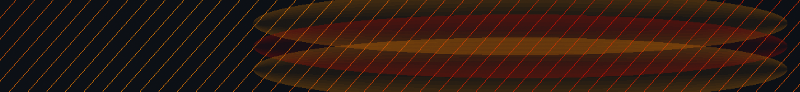
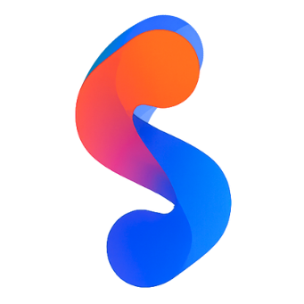

<!-- HERO -->

  

<h1 align="center">
  
</h1>

  <strong>AI/ML Engineer | Dual Majoring in CE & CS | 12x+ Hackathon Winner 🏆 | Startup Enthusiast 🚀</strong> 
  
  

  

  

## 🌟 About Me
🚀 Passionate about **Generative AI, LLMs, ML Models, Data Science, and Startups**  
💡 Startup Enthusiast on **Human-Centric AI**  
🎓 Final Year Student at **Khalifa University** and **Goldsmiths, University of London**  
🧠 Worked with **G42**, **Space42/Bayanat**, and engaged in **Undergraduate Research**  
🔥 **12x+ Hackathon Winner** — from AI to SpaceTech, see below  
🌍 **UN Young AI Leader (Abu Dhabi Hub)** — driving AI for Social Good  
🏁 **startAD × Google.org Sandbox Finalist** — top 1000+ ventures in impact innovation  
🛰️ Building an **unmanned aerial traffic management system using LLMs**

  

## 💥 Founder Initiative — 

  
  
<strong>Co-Founder of <a href="https://socia.ae" target="_blank">SociaHacks</a></strong> — the largest hackathon community in the Middle East. 
  Empowering students, developers and creators through hackathons, AI bootcamps and community-led innovation.

  

## 🚀 Tech Stack & Tools

  

## 📊 GitHub Stats & Contributions

  
  
    
  
    
  
    
  

## 🏆 Hackathon Wins

  

<table align="center">
  <tr><th>🏆 Hackathon / Program</th><th>🎖 Achievement</th></tr>
  <tr><td>Yapless — BCG Platinion Hackathon 2025 (Africa · ME · S Europe)</td><td>1st Place 🏆</td></tr>
  <tr><td>Baian Innovation Award 2025 (Congress of Arabic & Creative Industries)</td><td>1st Place 🏆</td></tr>
  <tr><td>DroneLM — Undergraduate Research & Innovation Competition (ADU)</td><td>2nd Place 🥈</td></tr>
  <tr><td>Mindprint Innovation Hackathon 2025 (UAE MOHAP)</td><td>1st Place 🏆</td></tr>
  <tr><td>FlyQ — The CrowdLabel Challenge (TII)</td><td>Global Best Idea Award 🌍</td></tr>
  <tr><td>F.A.L.C.O.N Digital Transformation Hackathon (Dubai Police & MBRSC)</td><td>1st Place 🏆</td></tr>
  <tr><td>Socia ADCCI × Nokia × startAD AI for Good Hackathon (Slush’d 2025)</td><td>1st Place 🔥</td></tr>
  <tr><td>F.L.O.R.E.S SpaceHacks (UAE Space Agency)</td><td>1st Place 🏆</td></tr>
  <tr><td>4th Annual Digital Transformation Hackathon</td><td>1st Place 🏆</td></tr>
  <tr><td>WTO MC13 Logistics Challenge</td><td>1st Place 🏅</td></tr>
  <tr><td>Dept. of Culture & Tourism Hackathon 2023</td><td>1st Place 🏅</td></tr>
  <tr><td>Green Campus Competition</td><td>Finalist 🌱</td></tr>
  <tr><td>NASA × JAXA × MBRSC Kibo-RPC 2024</td><td>3rd Place (Regional Finals) 🚀</td></tr>
  <tr><td>startAD × Google.org Sandbox Program</td><td>Finalist (Top 1000+) ⭐</td></tr>
</table>

## 🔥 Some Cool Stuff

  

## 📬 Connect with Me

  
  
  
  

<h3 align="center">🔥 Fun Fact</h3>

  I hum or whistle while coding and can whistle any song on demand — perfect for tech plus talent shows 🎶

  

